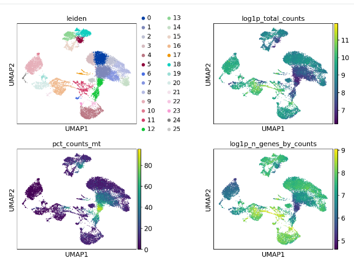
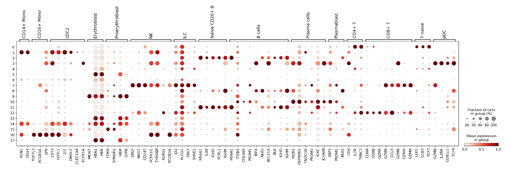
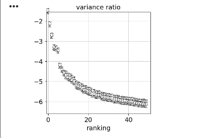

# 🧬 Single-Cell RNA-seq Analysis Pipeline

> **A structured, reproducible, end-to-end workflow** for single-cell RNA sequencing (scRNA-seq) analysis — from raw 10X Genomics FASTQ data to clustered and annotated cell populations.

---

##  Table of Contents

1. [Project Overview](#-project-overview)
2. [Pipeline Architecture](#-pipeline-architecture)
3. [Repository Structure](#-repository-structure)
4. [Stage Summaries](#-stage-summaries)
   - [Stage 1 — Preprocessing (Galaxy)](#stage-1--preprocessing-galaxy)
   - [Stage 2 — Scanpy Analysis (Python)](#stage-2--scanpy-analysis-python)
   - [Stage 3 — AnnData Exploration](#stage-3--anndata-exploration)
5. [Key Visual Outputs](#-key-visual-outputs)
6. [Environment Setup](#-environment-setup)
7. [How to Run](#-how-to-run)
8. [Reproducibility & Best Practices](#-reproducibility--best-practices)
9. [References](#-references)
10. [Author](#-author)

---

## 🔬 Project Overview

Single-cell RNA sequencing (scRNA-seq) has revolutionized our ability to study **cellular heterogeneity** at an unprecedented resolution. Unlike bulk RNA-seq, which averages gene expression across thousands of cells, scRNA-seq enables profiling of **individual cells** — revealing rare populations, developmental trajectories, and disease-specific signatures.

This pipeline provides a **complete, modular, and reproducible** workflow for scRNA-seq analysis built on industry-standard tools:

| Tool | Role | Purpose |
|------|------|---------|
| **Galaxy (GTN)** | Preprocessing | GUI-based alignment and QC — no coding required |
| **STARsolo** | Alignment | Efficient barcode-aware alignment of 10X FASTQ reads |
| **DropletUtils** | Cell calling | Distinguishes real cells from empty droplets |
| **MultiQC** | QC reporting | Comprehensive sequencing quality summary |
| **Scanpy** | Analysis | Clustering, dimensionality reduction, marker detection |
| **AnnData** | Data format | Unified, annotatable single-cell data container |

### Why This Pipeline?

-  **Modular** — each stage is independently documented and executable
-  **Reproducible** — Galaxy workflows + Jupyter notebooks ensure step-by-step replication
-  **Scalable** — designed around 10X Genomics Chromium data (the industry standard)
-  **Educational** — detailed explanations at every step for learning and auditing
- ✅**Best-practice aligned** — follows current community standards from the scverse ecosystem

---

##  Pipeline Architecture

```
Raw FASTQ Files (10X Genomics Paired-End)
        │
        ▼
┌─────────────────────────────┐
│  STAGE 1: PREPROCESSING     │  ← Galaxy (GTN)
│  • STARsolo Alignment        │
│  • DropletUtils Cell Calling │
│  • MultiQC Quality Control   │
│  • Count Matrix Generation   │
└────────────┬────────────────┘
             │  Gene-Cell Count Matrix (.mtx / .h5ad)
             ▼
┌─────────────────────────────┐
│  STAGE 2: SCANPY ANALYSIS   │  ← Python / Jupyter
│  • Cell-level QC Filtering  │
│  • Normalization & Scaling  │
│  • PCA (Dimensionality Red.)│
│  • Neighbor Graph + UMAP    │
│  • Leiden Clustering        │
│  • Marker Gene Detection    │
└────────────┬────────────────┘
             │  Clustered AnnData (.h5ad)
             ▼
┌─────────────────────────────┐
│  STAGE 3: ANNDATA WORKFLOWS │  ← Python / Jupyter
│  • Data Structure Exploration│
│  • Metadata Annotation       │
│  • Embedding Visualization   │
│  • Cell Type Assignment      │
└─────────────────────────────┘
             │
             ▼
   Annotated Cell Populations
```

---

## 📂 Repository Structure

```
single-cell-rnaseq-pipeline/
│
├── 1_preprocessing_10X_galaxy/               # Stage 1: Raw data → Count matrix
│   ├── DropletUtils Plot on dataset 14-16].png    # Cell/empty droplet barcode plot
│   ├── DropletUtils _RNA star.zip                 # DropletUtils output archive
│   ├── MultiQC on dataset 13_ Stats].tabular      # MultiQC statistics table
│   ├── RNA STARSolo on dataset 1-6_ Matrix Gene Counts raw].mtx  # Raw count matrix
│   └── RNA STARSolo on dataset 1-6_ log].txt      # STARsolo alignment log
│
├── 2_scanpy_analysis/                        # Stage 2: Downstream Python analysis
│   ├── visuals/                              # All generated plots
│   │   ├── scatter_plot.png                  # Cell QC scatter (nGenes vs nCounts)
│   │   ├── pca_samples.png                   # PCA projection of cells
│   │   ├── pca_variance_ratio.png            # Explained variance per PC
│   │   ├── umap.png                          # UMAP embedding (basic)
│   │   ├── umap_4.png                        # UMAP with Leiden clusters labeled
│   │   └── dot_plot.png                      # Marker gene dot plot by cluster
│   └── scrna (1).ipynb                       # Full Scanpy analysis notebook
│
├── 3_AnnData/                                # Stage 3: AnnData structure & annotation
│   ├── visuals/
│   │   ├── cpm_vs_raw_counts.png             # Raw vs normalized expression comparison
│   │   ├── distance_matrix_raw.png           # Pairwise cell distance matrix
│   │   ├── embeddings_plot.png               # Dimensionality reduction embeddings
│   │   └── sorted heatmap.png                # Sorted gene expression heatmap
│   ├── Getting_started_with_anndata .ipynb   # AnnData basics notebook
│   └── Getting_started_with_the_anndata_package.ipynb  # Extended AnnData tutorial
│
├── README.md                                 # ← You are here
└── requirements.txt                          # Python dependencies
```

---

##  Stage Summaries

### Stage 1 — Preprocessing (Galaxy)
📁 [`1_preprocessing_10X_galaxy/`](1_preprocessing_10X_galaxy/README.md)

Raw paired-end FASTQ files from the 10X Genomics Chromium platform are processed through a Galaxy-based workflow:

- **STARsolo** aligns reads, extracts cell barcodes and UMIs, and generates a raw gene-cell count matrix in `.mtx` format
- **DropletUtils** uses the barcode rank distribution (knee plot) to distinguish true cells from empty droplets
- **MultiQC** aggregates quality metrics including mapping rate, read duplication, and sequencing depth

**Input:** Paired FASTQ (R1 = barcode+UMI, R2 = cDNA)  
**Output:** Sparse count matrix (`.mtx`), barcode/gene lists, `.h5ad` AnnData object

📄 [→ Detailed Preprocessing README](1_preprocessing_10X_galaxy/README.md)

---

### Stage 2 — Scanpy Analysis (Python)
📁 [`2_scanpy_analysis/`](2_scanpy_analysis/README.md)

The count matrix is loaded into **Scanpy** for a full analytical workflow in a Jupyter notebook:

- **Cell-level QC:** Filter cells by number of expressed genes, total counts, and mitochondrial gene fraction
- **Normalization:** Library-size normalization to 10,000 counts per cell, followed by log1p transformation
- **Feature selection:** Identification of highly variable genes (HVGs) for downstream analysis
- **PCA:** Linear dimensionality reduction capturing major axes of variation
- **UMAP:** Nonlinear 2D projection for visualization of cell relationships
- **Leiden clustering:** Graph-based community detection to define cell clusters
- **Marker gene analysis:** Identification of differentially expressed genes per cluster using rank_genes_groups

**Input:** Raw `.mtx` or `.h5ad`  
**Output:** Clustered `.h5ad`, UMAP plots, marker gene tables

 [→ Detailed Scanpy README](2_scanpy_analysis/README.md)

---

### Stage 3 — AnnData Exploration
 [`3_AnnData/`](3_AnnData/README.md)

Explores the **AnnData** data structure that underpins the entire scverse ecosystem:

- Understanding `.X`, `.obs`, `.var`, `.obsm`, `.layers`, and `.uns` slots
- Subsetting cells and genes; views vs. copies
- Adding and manipulating metadata (`.obs`, `.var`)
- Storing and accessing dimensionality reduction embeddings (`.obsm`)
- Visualizing raw vs. normalized expression, distance matrices, and sorted heatmaps
- Manual cell type annotation by mapping cluster IDs to biological labels

**Input:** AnnData objects from Stage 2  
**Output:** Fully annotated `.h5ad` files ready for publication-quality analysis

 [→ Detailed AnnData README](3_AnnData/README.md)

---

## Key Visual Outputs

### UMAP Cluster Visualization
> Cells projected into 2D space; each color represents a distinct Leiden cluster



---

### Marker Gene Dot Plot
> Expression level (dot size = % cells expressing; color = mean expression) of top marker genes per cluster



---

### PCA Variance Ratio
> Proportion of total variance explained by each principal component — guides PC selection



---

### Barcode Rank Plot (DropletUtils)
> Knee plot distinguishing true cells (high UMI counts) from empty droplets (low UMI counts)


---

### Sorted Gene Expression Heatmap
> Hierarchically sorted expression matrix revealing transcriptional programs across clusters


---

## 🛠️ Environment Setup

### Prerequisites

- Python ≥ 3.8
- pip or conda

### Installation

```bash
# Clone the repository
git clone https://github.com/SyedaMomina7/single-cell-rnaseq-pipeline.git
cd single-cell-rnaseq-pipeline

# Install required Python packages
pip install -r requirements.txt
```

### `requirements.txt`

```
scanpy>=1.9.0
anndata>=0.9.0
numpy>=1.23.0
pandas>=1.5.0
matplotlib>=3.6.0
scipy>=1.9.0
seaborn>=0.12.0
leidenalg>=0.9.0
python-igraph>=0.10.0
umap-learn>=0.5.3
```

---

## How to Run

### Step 1 — Preprocessing (Galaxy)

1. Log into [usegalaxy.org](https://usegalaxy.org)
2. Upload your paired FASTQ files (R1 + R2)
3. Run **RNA STARsolo** with 10X Chromium v3 parameters
4. Run **DropletUtils** on the STARsolo output
5. Run **MultiQC** for sequencing QC summary
6. Export the `.mtx` matrix and `.h5ad` file

### Step 2 — Scanpy Analysis

```bash
cd 2_scanpy_analysis
jupyter notebook "scrna (1).ipynb"
```

Execute cells in order. Outputs (plots + `.h5ad`) are saved to `visuals/`.

### Step 3 — AnnData Exploration

```bash
cd 3_AnnData
jupyter notebook Getting_started_with_the_anndata_package.ipynb
```

---

##  Reproducibility & Best Practices

This pipeline is designed with reproducibility as a first-class concern:

| Practice | Implementation |
|----------|---------------|
| **Fixed random seeds** | `random_state=42` in PCA, UMAP, and clustering |
| **Version pinning** | All dependencies pinned in `requirements.txt` |
| **Modular notebooks** | Each stage is a self-contained, well-documented notebook |
| **Galaxy workflow export** | GTN workflows are exportable as `.ga` JSON for exact replication |
| **Intermediate saves** | AnnData objects are saved as `.h5ad` after each major stage |
| **Inline documentation** | Every analysis step includes biological interpretation |

---

##  References

- [Galaxy Training Network (GTN)](https://training.galaxyproject.org/training-material/topics/single-cell/)
- [Scanpy Documentation](https://scanpy.readthedocs.io/)
- [AnnData Documentation](https://anndata.readthedocs.io/)

---

## 👩‍💻 Author

**Syeda Momina**  
GitHub: [@SyedaMomina7](https://github.com/SyedaMomina7)

---
